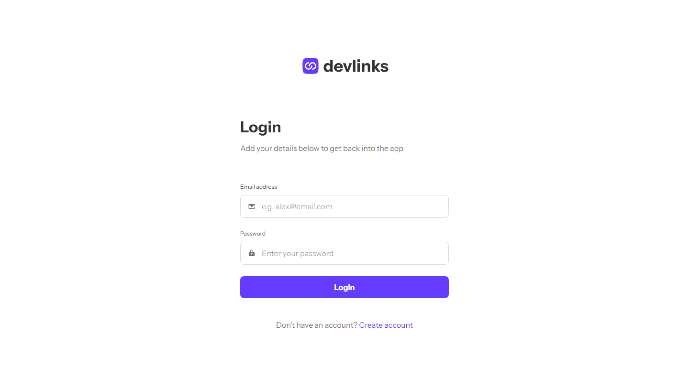

# Frontend Mentor - Link-sharing app solution

This is a solution to the [Link-sharing app challenge on Frontend Mentor](https://www.frontendmentor.io/challenges/linksharing-app-Fbt7yweGsT). Frontend Mentor challenges help you improve your coding skills by building realistic projects.

## Table of contents
- [How to install project](#How-to-install-project)
- [How to run project](#How-to-run-project)
  - [Available Scripts](#Available-Scripts)
  - [`npm start`](#npm-start)
  - [`npm test`](#npm-test)
  - [`npm run build`](#npm-run-build)
  - [`npm run eject`](#npm-run-eject)
- [Overview](#overview)
  - [The challenge](#the-challenge)
  - [Links](#links)
- [My process](#my-process)
  - [Built with](#built-with)
  - [Architecture](#architecture)
    - [Frontend](#frontend)
  - [What I learned](#what-i-learned)
  - [Useful resources](#useful-resources)
- [Author](#author)

## How to install project
- npm create vite@latest

## How to run project
- this is mini project where customers can create, read, update and delete comments.Also they can do replies to others and then also delete and update this info.

### Available Scripts

In the project directory, you can run:

### `npm start`

Runs the app in the development mode.\
Open [http://localhost:5173](http://localhost:5173) to view it in your browser.

The page will reload when you make changes.\
You may also see any lint errors in the console.

### `npm test`

Launches the test runner in the interactive watch mode.\
See the section about [running tests](https://facebook.github.io/create-react-app/docs/running-tests) for more information.

### `npm run build`

Builds the app for production to the `build` folder.\
It correctly bundles React in production mode and optimizes the build for the best performance.

The build is minified and the filenames include the hashes.\
Your app is ready to be deployed!

See the section about [deployment](https://facebook.github.io/create-react-app/docs/deployment) for more information.

### `npm run eject`

**Note: this is a one-way operation. Once you `eject`, you can't go back!**

If you aren't satisfied with the build tool and configuration choices, you can `eject` at any time. This command will remove the single build dependency from your project.

Instead, it will copy all the configuration files and the transitive dependencies (webpack, Babel, ESLint, etc) right into your project so you have full control over them. All of the commands except `eject` will still work, but they will point to the copied scripts so you can tweak them. At this point you're on your own.

You don't have to ever use `eject`. The curated feature set is suitable for small and middle deployments, and you shouldn't feel obligated to use this feature. However we understand that this tool wouldn't be useful if you couldn't customize it when you are ready for it.

## Overview

### The challenge

Users should be able to:

- Create, read, update, delete links and see previews in the mobile mockup
- Receive validations if the links form is submitted without a URL or with the wrong URL pattern for the platform
- Drag and drop links to reorder them
- Add profile details like profile picture, first name, last name, and email
- Receive validations if the profile details form is saved with no first or last name
- Preview their devlinks profile and copy the link to their clipboard
- View the optimal layout for the interface depending on their device's screen size
- See hover and focus states for all interactive elements on the page
- **Bonus**: Save details to a Localstorage 
- **Bonus**: Create an account and log in 

### Links

- Solution URL: [GitHub Repo]( )
- Live Site URL: [Link Sharing App]( )

## My process

### Built with

- [@vitejs/plugin-react](https://github.com/vitejs/vite-plugin-react/blob/main/packages/plugin-react/README.md) uses [Babel](https://babeljs.io/) for Fast Refresh
- [@vitejs/plugin-react-swc](https://github.com/vitejs/vite-plugin-react-swc) uses [SWC](https://swc.rs/) for Fast Refresh

### Architecture

#### Frontend

The front end of this app was built using Vite with the React.js library. The overall page structure is a React Router application wrapped in a React Query Provider and two Context Providers, one for authentication and one for data manipulation.

On initial page load, the application checks for a logged-in user from sessionStorage. If no user exists, the user is redirected to the login screen.



From there, the user can either log in or create an account. On successful authentication, the home page renders a list of links (or a placeholder indicating that no links currently exist). The user can toggle between this page and a "Profile Details" page to update personal information.


Finally, a preview page is provided to view a preview of the current data the user has provided.


The sharable links page is similar to the preview page (in fact, it uses the same display component) however it does not check for user authentication and instead fetches the user's data independently of the application's contexts. This provides a sharable links page to be used on social media or personal websites.

### What I learned

This project was my first using session-based user authentication. I accomplished this by utilizing sessionStorage in the client to maintain the user data provided by Json when the user logs in. From there, the user can refresh the page and navigate to other sites while maintaining logged-in status, however this is broken upon closing the tab or browser.

The most difficult portion of this project was the complex form validation required by the design. For the login and signup pages, I accomplished this by creating a useForm hook to supply validation functions to each component utilizing forms. As an addition to the design, I also added indicators of invalid password use when creating an account. An example of this is below:


This proved most difficult when implementing validation for the link url data. The design required validation that not only was the field not empty, but also that the url matched the required format. This was accomplished by storing links on the client with a ref attribute that was applied to the data when each link was rendered. When the form is saved, each link's ref is passed to a validation method which check's the input's value against the appropriate url template according to the selected platform.


If a mismatch exists, the class 'invalid' is attached to the ref's current node and a data attribute for 'valid-url' is set to false to indicate the specific invalidity. The data attribute and class name are used to set higher specificity with the CSS classes used for invalid inputs, which will set an invalid URL at a higher specificity than a general empty field.

```css
label:has(input.invalid)::after,
label:has(input[data-url='true'].invalid)::after {
    content: 'Can\'t be empty';
}

label:has(input[type='text'][data-valid-url='false'])::after {
    content: 'Please check the URL';
}
```

## Author

- Frontend Mentor - [Alexander Tsamalashvili](https://github.com/AlexTsamala)
- Developer - [Lazare Chkhartishvili](https://github.com/Lazzzare)
- Developer - [Davit Kevkhishvili](https://github.com/HarLey021)
- Developer - [Temur Tsintsadze](https://github.com/TTsintsadze)